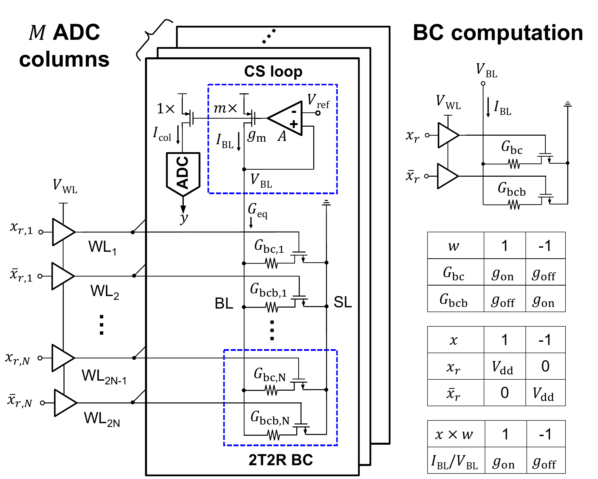

# eNVM-IMC-Modeling

Behavioral SNDR modeling and measured validation for parallel-bar resistive in-memory computing across MRAM, ReRAM, and FeFET.

[Interactive website](https://calmyor.github.io/eNVM-IMC-Modeling/) · [JxCDC 2024 paper](https://doi.org/10.1109/JXCDC.2024.3381888) · [MIT License](LICENSE.txt)



## Overview

This repository accompanies:

> Saion K. Roy and Naresh R. Shanbhag, “Energy-Accuracy Trade-offs for Resistive In-Memory Computing Architectures,” *IEEE Journal on Exploratory Solid-State Computational Devices and Circuits*, vol. 10, pp. 22–30, 2024.

The code models how device, array, sensing, and ADC non-idealities jointly limit the signal-to-noise-plus-distortion ratio (SNDR) of a parallel-bar resistive IMC bank. It supports the paper’s analyses of:

- MRAM-, ReRAM-, and FeFET-based parallel-bar architectures;
- dot-product dimension, conductance contrast, ADC precision, and reference-voltage sweeps;
- individual analog non-idealities and their combined effect;
- energy-versus-SNDR trade-offs; and
- behavioral-model validation against measured data from a 22 nm MRAM IMC prototype.

The [interactive website](https://calmyor.github.io/eNVM-IMC-Modeling/) presents the broader device-agnostic design method and an illustrative multi-bank architecture builder. The numerical scripts in this repository reproduce the specific models, data, and figures associated with the 2024 paper.

## Design perspective

The analysis organizes parallel-bar accuracy around four coupled constraint groups:

1. **Device:** conductance levels, conductance contrast, and state variation.
2. **Array:** dot-product dimension and wire/parasitic effects.
3. **Sensing:** current-mirror mismatch and analog readout noise.
4. **ADC:** reference range, quantization, and thermal noise.

The useful operating point is determined by their combined SNDR rather than by any one parameter in isolation.

## Repository structure

| Path | Contents |
| --- | --- |
| `SNDR-sim/MRAM/` | MRAM device-level SNDR sweeps and generated arrays |
| `SNDR-sim/ReRAM/` | ReRAM device-level SNDR sweeps and generated arrays |
| `SNDR-sim/FeFET/` | FeFET device-level SNDR sweeps and generated arrays |
| `SNDR-sim/Individual-non-idealities/` | MRAM reference-voltage analysis for individual non-idealities; paper Fig. 5 |
| `SNDR-sim/SNDRa-vs-N/` | Analog SNDR versus dot-product dimension; paper Fig. 6a |
| `SNDR-sim/SNDRa-vs-contrast/` | Analog SNDR versus conductance contrast; paper Fig. 6b |
| `SNDR-sim/SNDRd-vs-BADC/` | Digital SNDR versus ADC precision; paper Fig. 6c |
| `SNDR-sim/SNDRd-vs-Energy/` | Energy per 1-bit operation versus digital SNDR; paper Fig. 7 |
| `SNDR-sim/Validation-with-chip-data/` | Measured data, behavioral predictions, and validation plot; paper Fig. 4 |
| `docs/` | Standalone project website deployed through GitHub Pages |

## Requirements

- Python 3
- NumPy
- SciPy
- Matplotlib

Create an isolated environment:

```bash
git clone https://github.com/calmyor/eNVM-IMC-Modeling.git
cd eNVM-IMC-Modeling

python3 -m venv .venv
source .venv/bin/activate
python -m pip install --upgrade pip
python -m pip install numpy scipy matplotlib
```

## Quick start

The repository includes the intermediate NumPy arrays used by the summary plotting scripts. To reproduce a tracked paper figure directly, run the plotting script from its own directory:

```bash
cd SNDR-sim/SNDRa-vs-N
python SNDRa_max_vs_N.py
```

This regenerates `SNDRa_max_vs_N.pdf` from the included MRAM, ReRAM, and FeFET arrays.

> **Working-directory requirement:** run each script from the directory that contains it. The scripts use relative paths for their input and output files.

## Reproduce the paper figures

| Paper result | Run from | Command | Generated output |
| --- | --- | --- | --- |
| Fig. 4: measured validation | `SNDR-sim/Validation-with-chip-data/` | `python ADC_results_chip_compare.py` | `ADC_errorbar_measured_vs_bev.pdf` |
| Fig. 5: individual non-idealities | `SNDR-sim/Individual-non-idealities/` | `python Pbar_MRAM_SNDRa_Vref_Swp_individual_non-idealities.py` | `SNDR_vs_Vref_MRAM_all.pdf` |
| Fig. 6a: SNDR versus dimension | `SNDR-sim/SNDRa-vs-N/` | `python SNDRa_max_vs_N.py` | `SNDRa_max_vs_N.pdf` |
| Fig. 6b: SNDR versus contrast | `SNDR-sim/SNDRa-vs-contrast/` | `python SNDRa_max_vs_contrast.py` | `SNDRa_max_vs_ratio.pdf` |
| Fig. 6c: SNDR versus ADC bits | `SNDR-sim/SNDRd-vs-BADC/` | `python SNDRd_max_vs_BADC.py` | `SNDRd_max_vs_BADC.pdf` |
| Fig. 7: energy versus SNDR | `SNDR-sim/SNDRd-vs-Energy/` | `python SNDRd_vs_Energy_plot.py` | `E_1bop_vs_SNDRd_N_*.pdf` |

## Regenerate the device-level arrays

The `MRAM/`, `ReRAM/`, and `FeFET/` directories contain the behavioral-model scripts that generate the intermediate arrays:

| Device-level script pattern | Generated quantity | Summary directory |
| --- | --- | --- |
| `Pbar_*_SNDRa_Max_vs_N.py` | `SNDRa_dB_*_vs_N.npy` | `SNDRa-vs-N/` |
| `Pbar_*_SNDRa_Max_vs_contrast.py` | `SNDRa_dB_*_vs_ratio.npy` | `SNDRa-vs-contrast/` |
| `Pbar_*_SNDRd_Max_vs_BADC.py` | `SNDRd_dB_*_vs_BADC.npy` | `SNDRd-vs-BADC/` |
| `Pbar_*_SNDRd_Max_vs_N.py` | `SNDRd_dB_*_vs_N.npy` and `AGeq_*_vs_N.npy` | `SNDRd-vs-Energy/` |

Run a device script from its device directory, then copy the generated `.npy` file into the corresponding summary directory before running the consolidated plotting script.

Example:

```bash
cd SNDR-sim/ReRAM
python Pbar_ReRAM_SNDRa_Max_vs_N.py
cp SNDRa_dB_ReRAM_vs_N.npy ../SNDRa-vs-N/

cd ../SNDRa-vs-N
python SNDRa_max_vs_N.py
```

Repeat the device-level step for MRAM and FeFET when regenerating a complete three-device comparison.

## Reported findings

For the device, circuit, and architecture configurations evaluated in the paper:

- pre-ADC array non-idealities dominate at high output-signal magnitude, while ADC thermal noise dominates at small signal magnitude;
- for dot-product dimensions above 50, the modeled maximum SNDR ranks FeFET, ReRAM, then MRAM;
- increasing conductance contrast improves SNDR until the ratio reaches approximately 12;
- the modeled maximum SNDR across the evaluated sweeps is approximately 18–22 dB; and
- the evaluated ReRAM mapping reaches 84.5% ResNet-20 accuracy on CIFAR-10 at 22 dB SNDR.

These values describe the paper’s modeled and measured configurations. They should not be interpreted as universal guarantees for every device stack, circuit implementation, or workload.

## Citation

If you use this model or its data, please cite:

```bibtex
@article{roy2024energy,
  author  = {Saion K. Roy and Naresh R. Shanbhag},
  title   = {Energy-Accuracy Trade-offs for Resistive In-Memory Computing Architectures},
  journal = {IEEE Journal on Exploratory Solid-State Computational Devices and Circuits},
  year    = {2024},
  volume  = {10},
  pages   = {22--30},
  doi     = {10.1109/JXCDC.2024.3381888}
}
```

## Acknowledgements

This work was supported by the JUMP 2.0 Center for the Co-Design of Cognitive Systems (CoCoSys), funded by the Semiconductor Research Corporation (SRC) and the Defense Advanced Research Projects Agency (DARPA).

## License

This repository is released under the [MIT License](LICENSE.txt).
